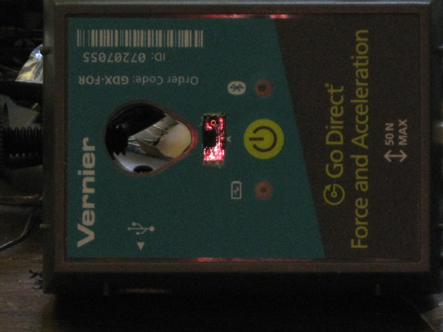

# Plug for Vernier Go Direct Force and Acceleration Sensor

In some circumstances it is desired to have the sensor body block IR from a photogate. In that case we may need to insert a plug in the mounting hole to block IR.

## Two Variants of the Plug

Two variants of the plug have been created and 3D printed. 

* The first variant is just a plug (on right in photo)
* The second variant contains the plug and a small rectangle indicating the approximate X-Y position of the accelerometer in the sensor case. (on left in Photo)

### Accelerometer Chip in Sensor

The photo below shows the accelerometer chip inside the sensor through a window.

